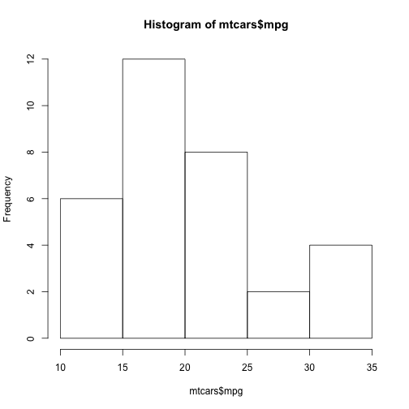

## The tabs in the shiny application

The Shiny application consists of three tabs. The first two 'try textbox' and 'try textbox 2' show different textboxes. The last tab called ' try others' shows an histogram'.

--- .class #id 

## The checkbox tab

At this tab one has the possibility to select a number:
- 50
- 100

This number will be multiplied by 2.

--- .class #id 

## A histogram of the cars dataset

When clicking the tab 'try others'. One can select the number of bins. The number of bins of the histogram will change according to the number of bin selected.

--- .class #id 

## 5. An Example of an histogram

